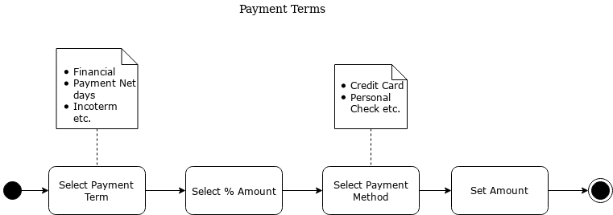
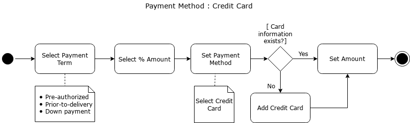
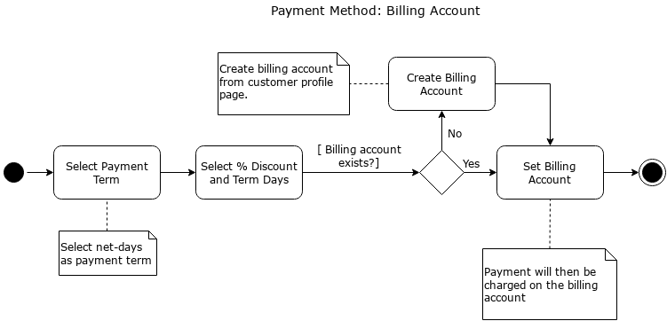

- Payment Terms are conditions agreed between business and customers for the payment of invoices.
- Selecting Payment Terms and Methods are key things in fulfillment of any order process.
-
- ### Payment process diagram
- 
-
- [select payment term]([[Order Term]])
- [Select Payment Method]([[Payment setting]])
-
-
- ### Payment Method diagram
- Depending on payment method process is not exactly the same.
- #### credit Card
- 
-
- #### Billing Account
- 
-
- For information about Billing Account look at [[Billing Accounts.]]
-
-
-