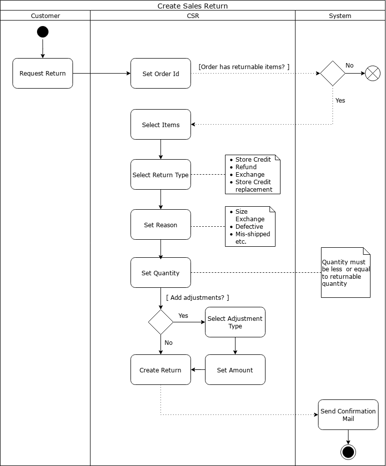
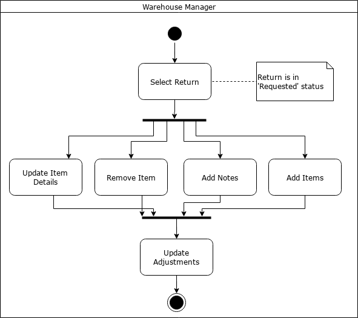
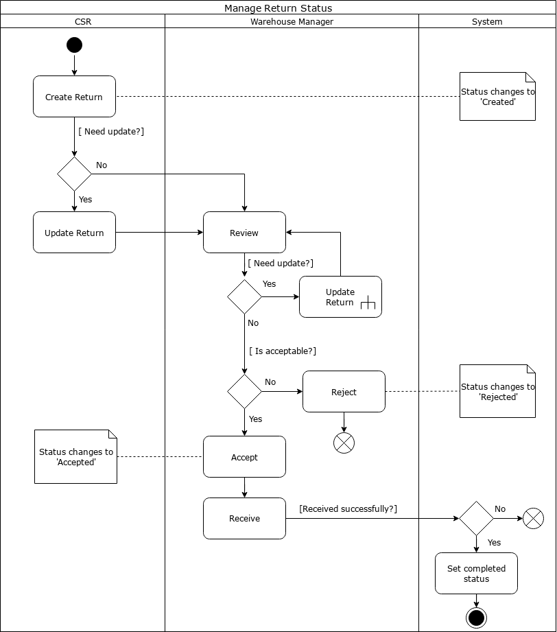

### Create Sales Return
- A customer requests for the return of the product. The reason for returning the merchandise can be defective goods, incorrect product specification, excess quantity shipped or wrong items shipped. The [[CSR]] accepts the return request and fills out the return details and creates a return with respect to the sales order.
- 
-
- ### Update Sales Return
- A user can request the CSR to update the return. The reason can be to add/remove items in previously created sales return or editing the returnable quantity. A CSR opts to put notes on the return related to communication or conclusion drawn on that return.
- #### Overview
- 
-
- #### Details
- {:height 702, :width 612}